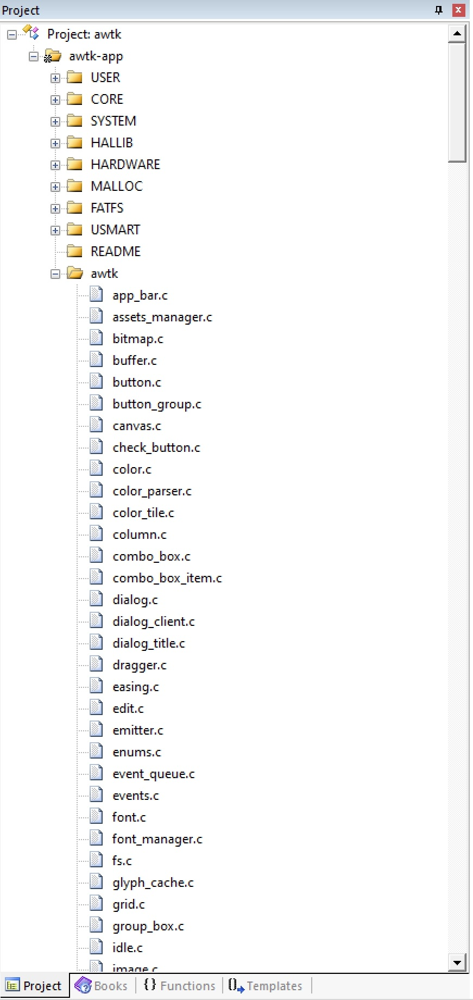
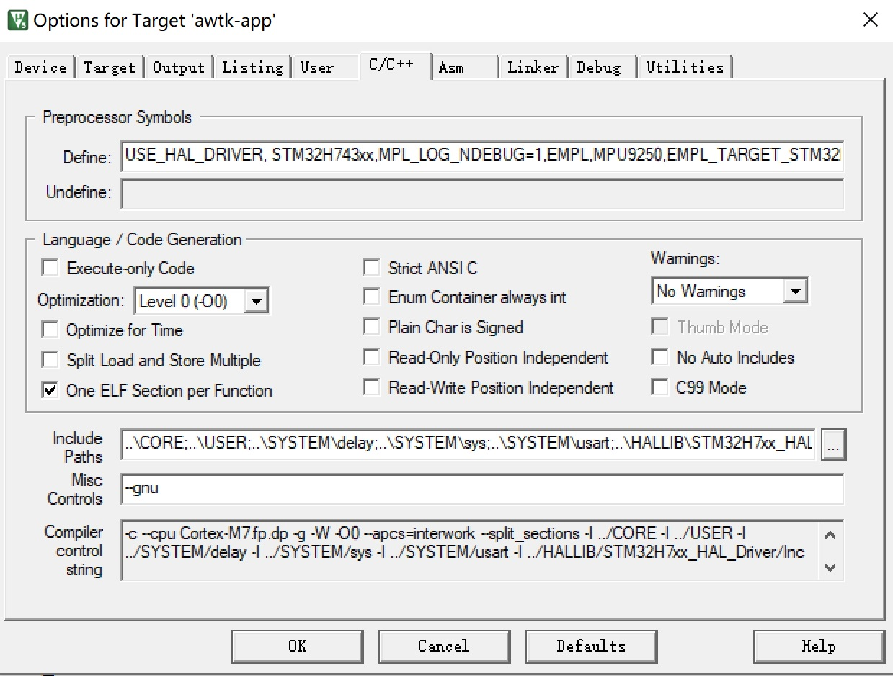

# STM32H743 移植笔记

## 1. 介绍

在移植的时候，不管是什么板子，拿到板子的资料后，先找一个带有显示功能的最简示例。以这个最简示例为模板，加入 AWTK 相关代码再进行移植。本文中使用开发板提供的 SD 卡的例子，具体位置在：

```
阿波罗STM32H743 资料盘(A盘)\4，程序源码\2，标准例程-HAL库版本\实验42 FATFS实验
```

> 这是一个 Keil 工程，在移植之前，先确保该工程能够正常编译、下载和运行。

## 2. 将 awtk 项目取到当前目录

* 从 github 上获取源码

```
git clone https://github.com/zlgopen/awtk.git
```

* 确保 awtk 是在当前目录中。

```
drwxr-xr-x 1 Admin 197121     0 5 月   4 21:50 awtk/
drwxr-xr-x 1 Admin 197121     0 5 月   4 19:06 CORE/
```

## 3. 在当前目前创建 awtk-port 子目录

```
drwxr-xr-x 1 Admin 197121     0 5 月   4 21:50 awtk/
drwxr-xr-x 1 Admin 197121     0 5 月   4 21:50 awtk-port/
drwxr-xr-x 1 Admin 197121     0 5 月   4 19:06 CORE/
```

## 4. 创建配置文件 awtk-port/awtk_config.h 

```
-rw-r--r-- 1 Admin 197121 2011 5 月   4 21:50 awtk_config.h
```

在创建配置文件时，以 awtk/src/base/awtk_config_sample.h 为蓝本，并参考类似平台的配置文件：

对于中端平台 (Cortex M4/M7)，典型的配置如下：

```

/**
 * 嵌入式系统有自己的 main 函数时，请定义本宏。
 *
 */
#define USE_GUI_MAIN 1

/**
 * 如果支持 png/jpeg 图片，请定义本宏
 *
 */
#define WITH_STB_IMAGE 1

/**
 * 如果支持 Truetype 字体，请定义本宏
 *
 */
#define WITH_STB_FONT 1

/**
 * 如果定义本宏，使用标准的 UNICODE 换行算法，除非资源极为有限，请定义本宏。
 *
 */
#define WITH_UNICODE_BREAK 1

/**
 * 如果定义本宏，将图片解码成 BGRA8888 格式，否则解码成 RGBA8888 的格式。
 *
 */
#define WITH_BITMAP_BGRA 1

/**
 * 如果定义本宏，将不透明的 PNG 图片解码成 BGR565 格式，建议定义。
 *
 */
#define WITH_BITMAP_BGR565 1

/**
 * 如果 FLASH 空间较小，不足以放大字体文件时，请定义本宏
 *
 */
#define WITH_MINI_FONT 1

/**
 * 如果启用 STM32 G2D 硬件加速，请定义本宏
 *
 */
#define WITH_STM32_G2D 1

/**
 * 如果启用 VGCANVAS，而且没有 OpenGL 硬件加速，请定义本宏
 *
 */
#define WITH_NANOVG_AGGE 1

/**
 * 如果启用 VGCANVAS，请定义本宏
 *
 */
#define WITH_VGCANVAS 1

/**
 * 如果启用竖屏，请定义本宏
 *
 */
//#define WITH_LCD_PORTRAIT 1

/**
 * 启用输入法，但不想启用联想功能，请定义本宏。
 *
 */
#define WITHOUT_SUGGEST_WORDS 1

#define WITH_IME_NULL 1
```

## 5. 加入 AWTK 的源文件

AWTK 的源文件很多，而且不同的平台，加入的文件有所不同，导致加文件的过程非常痛苦。为此，我把 cortex m4/m7 需要的文件，放到 files/files_m47.txt 文件中，并本生成 keil 需要的 xml 格式，放到 files/files_m47.xml 中。自己创建项目时，把 files/files_m47.xml 中的内容放到 USER/awtk.uvprojx 即可。

如果不知道放到 USER/awtk.uvprojx 中哪个位置，可以先在 keil 中创建一个 Group，名为 awtk，并添加一个 foobar.c 的文件：

> 在 foobar.c 中随便写点内容，如注释之类的东西。


保存并关闭项目，用 notepad++等编辑器打开 USER/awtk.uvprojx，找到 foobar.c 的位置：


用 files/files_m47.xml 中的内容替换选中部分的内容，保存文件并退出。

> 如果 awtk.uvprojx 文件不是在 Project（或其它名字）子目录下，而是项目根目录下（和 awtk 并列），则需要编辑 files/files_m47.xml，把 ..\awtk 替换成 .\awtk。

用 keil 重新打开工程文件 awtk.uvprojx，我们可以看到文件已经加入：



## 6. 配置 keil 工程

* 定义宏 HAS\_AWTK\_CONFIG

* 增加头文件路径

```
..\awtk\src\ext_widgets;..\awtk;..\awtk\src;..\awtk\3rd;..\awtk\3rd\nanovg\base;..\awtk\3rd\nanovg;..\awtk\3rd\agge;..\awtk\3rd\libunibreak;..\awtk-port
```
* Misc Controls 中加上--gnu 标志。

* 不要勾选 c99，否则 C++编译不了。

设置界面的效果如下：




修改 stm32h7xx_it.c，去掉SysTick_Handler的定义。

```c
#if 0
/**
  * @brief  This function handles SysTick Handler.
  * @param  None
  * @retval None
  */
void SysTick_Handler(void)
{
  HAL_IncTick();
	
}
#endif
```
